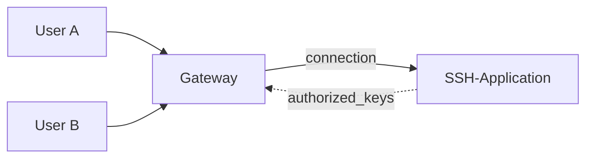

# user based SSH reverse proxy

## TL;DR Simple setup instructions

To setup the user-based reverse proxy the following steps should be
performed.

### On the Gateway

1. Create a key-pair for password-less login on the ssh-server using
   `ssh-keygen`
2. setup syncronization of `authorized_keys` for the proxied users
	* If the syncronization should be done via scp, add the public
	  key of the ssh-server to the gateways' `authorized_keys`. It
	  is recommended to call the syncronized variant
	  `authorized_keys2`
3. Install `sshproxy_gateway`
4. setup `~/ssh/proxy/gateway.conf`, a sample file is shipped
5. symlink the name of the ssh-application to `sshproxy_gateway`

### On the ssh app-server

1. If syncronization should be done via scp, create a key-pair using
   `ssh-keygen`
2. Install `sshproxy_host`
3. add `command="/usr/bin/sshproxy_host",no-port-forwarding,no-X11-forwarding,no-agent-forwarding,no-pty ssh-rsa ...`
   to the (not syncronized!) `authorized_keys` file
4. maybe setup path of `authorized_keys` in your application. the name
   `authorized_keys2` is recommended for that file

## The problem

Services with ssh-access, like [gitlab](https://gitlab.org) or
[gogs](https://github.com/gogs/gogs), distinguish their users via the
public used for a certain ssh-session. But all of the users use the same
username over the ssh connection.

For http(s)-Services it is possible to share a single external IP and
host and multiplex the incoming connections via hostname or URLs using a
reverse proxy. With the ssh-protocol, this is [virtually
impossible](https://serverfault.com/questions/34552/is-there-a-name-based-virtual-host-ssh-reverse-proxy).

Either way it would be nice to be able to move the ssh-based application
away from the gateway. Reserving a seperate port would introduce further
inconveniencies for the external users. To integrate with the most
popular ssh-server implementation (OpenSSH), those tools usually
maintain a `authorized_keys` file, which contain all public keys and a
`command`-Parameter, which is used to distinguish the keys for the
application.

A problem, why even tools like
[sshpiper](https://github.com/tg123/sshpiper) don't work, is that the
hostname is only passed via the encrypted connection and the client
performs a challenge to make sure, no man-in-the-middle servers are
involved (what a reverse proxy essentially is).

## Network layout

These points result in a network-layout like the in

% 

Using ssh-proxy, all connections made by a certain public key can be
passed to a certain program, the initial commandline passed by the
client to his `ssh` binary are passed via the environment
`SSH_ORIGINAL_COMMAND`

This shows, that the initial problem of an ssh reverse-proxy are indeed
two, the syncronization of the `authorized_keys` file and the muxing of
incoming connections.

## syncronization of `authorized_keys`

Due to the nature of user-based ssh proxying, there are connections for
the proxied users and syncronized public keys as well as the additional
public keys needed for the proxying itself. Because of that it is
recommended to split the `authorized_keys`-file into two. The default
configuration for `openssh` often sets two of these files:

* `authorized_keys`
* `authorized_keys2`

If this isn't done by default, it can be set using the line

    AuthorizedKeysFile     .ssh/authorized_keys .ssh/authorized_keys2

in `/etc/ssh/sshd_config`. For convenience reasons, the
`authorized_keys2` should be the one syncronized between app and gateway.

If the contents of this files (so the allowed public keys) change seldom
it might be sufficient to sync this file manually. For all other cases,
there are multiple solutions, as described in the following.

### network filesystem

Distributing the file using a distributed filesystem like `NFS`, `samba`
or a cluster like `ceph` or `glusterfs` is a well-tested solution.

It clearly has the advantage, that the file is in sync immediatly
between both hosts. However, setting up a fileserver only for this one
file might be a bit overkill.

### cron based sync

a second variant is to `scp` the file regularly, exp. via cron.

The script `sshproxy_syncfile` does this copying. In fact it checks, wether the
file has been modified before performing the file-transfer itself.

In preparation an additional key-pair should be generated, so that
password-less login from the SSH-Application to the Gateway is possible.

The public key of that file should then be added in a seperate line in
the `authorized_keys` on the gateway.

    command="internal-sftp",restrict ssh-rsa ...

should do this. The gateway should assure, that this file isn't tempered
with afterwards.

#### regular calling with systemd

The easiest way to do this would be via a cron script.

Alternatively, this can be done using a systemd-timer as well. The
corresponding files (`sshproxy_syncfile.target` and
`sshproxy_syncfile.timer`) are provided.

As the timer should be started as a certain user (eg. `sshapp`), the
corresponding user-session has to be always active (not only after
login), so the following command should be executed as root on the
application server:

    loginctl enable-linger sshapp

Afterwards the trigger can be enabled by

    systemctl --user enable sshproxy_syncfile.timer

#### regular calling with cron

For convenience, the file `ssphroxy_syncfile.cron` is provided as a
template for regular execution of file syncronization via cron.

In this file, the username and path should be adjusted.

With resp. to the systemd timer, it has the advantage, that a mail is
send everytime a public key is updated and it is easier to set up.
On the other hand the systemd management  isnt' available.

## proxying external connections

The main task of an ssh-proxy is to forward ssh-connections coming from
external hosts to an internal machine. This includes the initiation of a
new connection from the gateway to that internal machine, which is
easiest done using a seperate command.

### Gateway side preparation

This command should be called everytime, a user logged in using a public
key. This can either be done using the `command=""` parameter in the
`authorized_keys` file, the `~/.ssh/rc` file or the `ForceCommand`
option in `/etc/sshd_config`.

The command `sshproxy_gateway` implements the forwarding of the
connection. It will read the first of the following configuration files
found. If none is available, it will fail. `<applicationname>` is
replaced by the name, the application is called with, which comes in
handy for symlinking the file - see below.

* `~/.ssh/proxy/<applicationname>.conf`
* `~/.ssh/proxy/gateway.conf`
* `/etc/ssh/proxy/<applicationname>.conf`
* `/etc/ssh/proxy/gateway.conf`

This file contains a list of `key=value` pairs, where key can be one
of the following:

`internal_server`:
the name of the internal server to connect to

`user`:
username to use on the internal server. By default the username on the
gateway will be used.

`ssh_command`:
name of the `ssh`-application to use. By default `ssh %s@%s %s` with
`user`, `internal_server` and the command to execute as paramters to
this printf-like expression.

The application will then open a connection to the internal server,
pass its own name with all parameters as 'command to execute' and
the client-side command in the additional environment-like string
`X_SSH_ORIGINAL_COMMAND`.

For this to work, a key-pair has to be generated and prepared for using
for connections between the server and the ssh-application.

#### Integrate ssh-application

Most ssh-applications with handling of an `authorized_keys` file already
set the `command=` parameter for each public key. As long as this is the
case, the `sshproxy_gateway` appliction can be used to pass all the
parameters set by this application to the application on the proxied
host by setting a symlink to the application on the gateway.

It is important, that the application itself isn't available on the
gateway.

If the application set something like `command="/usr/bin/sshapp
user-123"` into the `authorized_keys`, the command

    ln -s /usr/bin/sshproxy_gateway /usr/bin/sshapp

can be used.

### SSH-application side preparation

On the ssh-application all external connections are now received over
the same public key from the gateway. As long as no internal
connections, which bypass the gateway, are needed, the `authorized_keys`
file handled by the applicaiton doesn't need to be visible to the
ssh-service itself.

To demultiplex the different users again, the information provided by
`sshproxy_gateway` need to be separated on the proxied host, which can
be done by `sshproxy_host`. To do so, the (unsyncronized!)
`authorized_keys` file should contain the following definition for the
public key of the gateway:

    `command="/usr/bin/sshproxy_host",no-port-forwarding,no-X11-forwarding,no-agent-forwarding,no-pty ssh-rsa ...`

This will execute the `SSH_ORIGINAL_COMMAND` and pass the commandline
specified by the user according to the ssh specs.
